# Teste prático de PHP/Vue
Projeto estruturado para trabalhar com VueJS 2, backend Laravel, estilização com Tailwind.

## Por onde começar

* Faça um clone deste projeto;
    ```bash
    git clone https://github.com/FelipePPJ/eyecare.git
    ```
* Utilize o arquivo .env exemplo para setar as configurações base de banco de dados:
    ```bash
    .env.example
    ```
* Após configuração do banco de dados lembre-se de criar uma nova chave para o projeto
    ```bash
    php artisan key:generate
    ```
* Após ajustes realizados, basta executar o setup base para instalar dependências e a estrutura inicia
    ```bash
    php artisan migrate
    php artisan db:seed
    npm install
    composer install
    php artisan config:clear
    php artisan route:clear
    php artisan view:clear
    php artisan cache:clear
    php artisan config:cache
    npm run build
    ```
<br/>

## Tecnologias Explorados
* PHP, Laravel, APIs;
* VueJS 2;
* Tailwind;
<br/>

## Dificuldades Exploradas
* A implementação com VueJS foi mais demoradas devido a inexperiência. Costumo utilizar Laravel/Livewire como reatividade;
* Tailwind não costuma ser a estilização padrão que utilizo. Normalmente utilizo Bootstrap.
Tais pontos foram interessantes de se trabalhar com uma implementação do zero.
<br/>

## Estruturação do projeto
Foi levada a premissa de que cada tecnologia utilizada devesse ser explorada com seus pontos fortes, separando assim as responsabilidades e estruturas respectivas.

### Laravel
* Tratar todos os processos de backend;
* Renderização base de front;
* API;
* Roteamento;
* Traduções;
* Estruturação dos dados e registros;
* Processamento dos dados e registros;
* Arquitetura MVC;
* Aplicação de PSR-2;
* Componentização do VueJS;
* Exportação de PDF;
* Seeder de grupos e exames;

### VueJS
* Tratar todos os processos de frontend;
* Criação de componentes;
* Consumo de API;
* Páginas reatividades;
* Estrutura CRUD;
* Estilização via Tailwind;

### MySQL
* Estruturação de tabelas com tipagem forte e relacionamentos;
* Criado um relacionamento a partir de uma tabela de grupos (separador de grupos para exportação em PDF segmentado) para explorar este recurso;
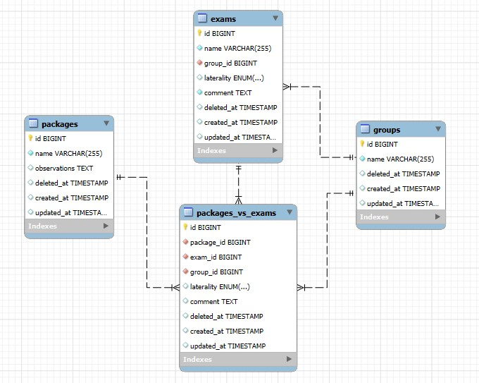

#### Observações
O VueJS foi a peça chave de conexão de todo o sistema, pois a partir dele é que existe a interação do usuário e iteração de todas as tecnologias. Foi utilizado o principio de componentização para criar cada estrutura interativa. Como o projeto do frontend está associado ao Laravel, cada página possui uma rota, não se tratando de uma SAP.

As regras de negócio foram seguidas a risca de acordo com a compreensão para garantir a usabilidade e também possibilidades de versões seguintes com melhorias gradativas.
<br/>

## Pontos de melhoria para próximas versões
Por se tratar de uma primeira versão, foram atendido ao máximo os objetivos do teste. Para não delongar demais, existem pontos já mapeados para melhorias futuras, são eles:
* VueJS: Componentes com paginação;
* VueJS: Melhor isolamento e reaproveitamento de componentes;
* VueJS: Separar projeto do backend (não foi feito inicialmente por inexperiência mesmo);
* Rota para exclusão de exames (softDelete);
* Rota para exclusão de pacotes (softDelete);
* Estrutura de banco para armazenamento de uma solicitação de exames;
* Rotas para tratar solicitações de exames;
* Área de gestão (CRUD) para usuários/médicos;
* Área de gestão (CRUD) para pacientes;
* Ajustes pontuais em regras de negócios referente a edição de campos dos forms;
* Tabela de Logs para controle de eventos;
* Api: Criar camada de validação por usuário|token|sessão;
* Api: Consumo via CSRF|Bearer|JWT;
* Tailwild: Aplicação de identidade visual;
* Tailwild: Melhorias na responsividade;
* Container de estruturas para o back, front, banco [por mais que hoje meu ambientes de teste já seja em containers (Docker, Portainer, Traefik, Nginx, MySQL, entre outros), o projeto em si foi gerado unificado];
* Documentação: Refinar documentação de classes, componentes, API/Postman;

## Considerações finais
Este foi um projeto desafiador, pois fugiu em boa parte do ecosistema habitual que costumo utilizar (focado principalmente no backend). Sustentar sistemas já ambientados com esta estrutura se torna simples em comparação a elabora-la por completo. O VueJS e o Tailwild são ótimas ferramentas para o frontend no qual estou estudando para me aperfeiçoar mais.

## Imagens
<br>
#### Home
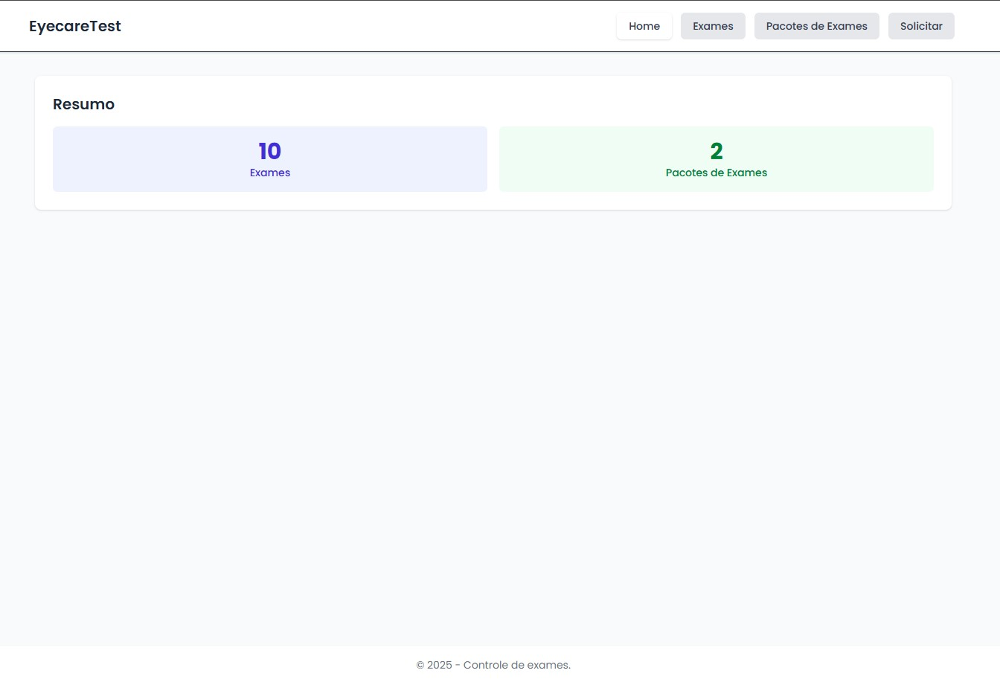

#### Telas de Exames
Visão geral da relação de exames
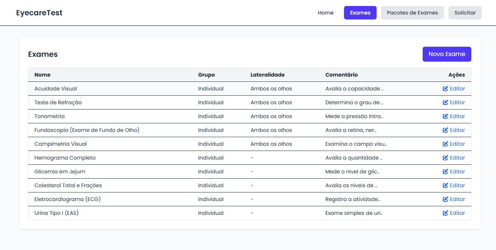
Modal para cadastro de um novo exame
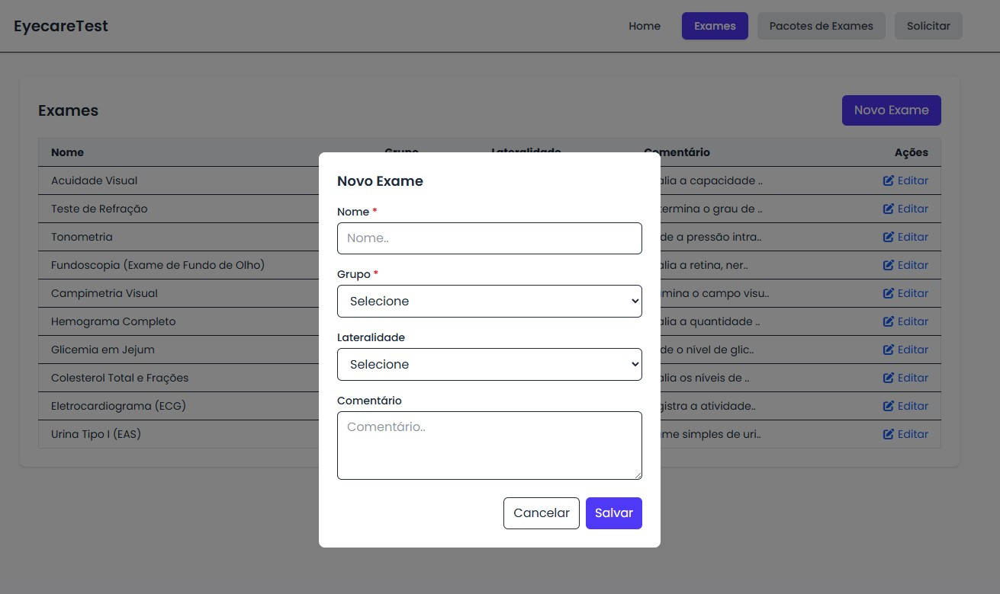
Modal para edição de um exame existente
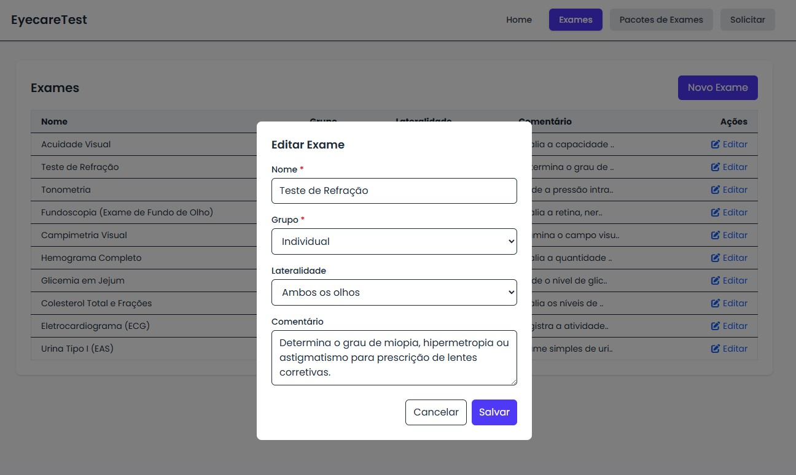

#### Telas de Pacotes
Visão geral de pacotes de exames cadastrados
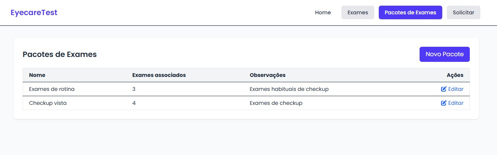
Modal para cadastro de um novo pacote de exames
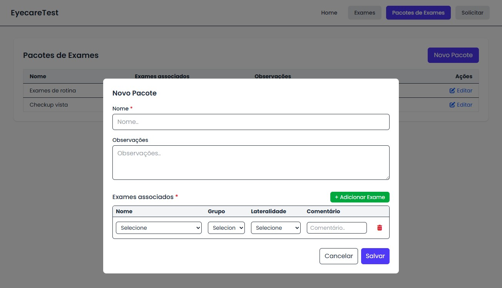
Modal para edição de um pacote de exames existente
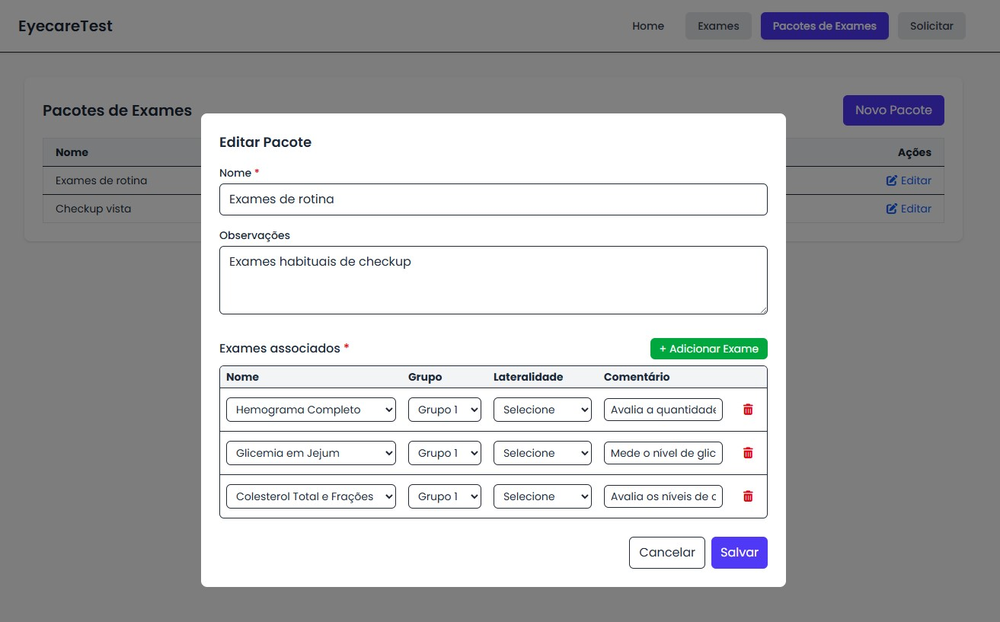

#### Telas de Solicitação de Exames
Visão geral da tela de solicitações
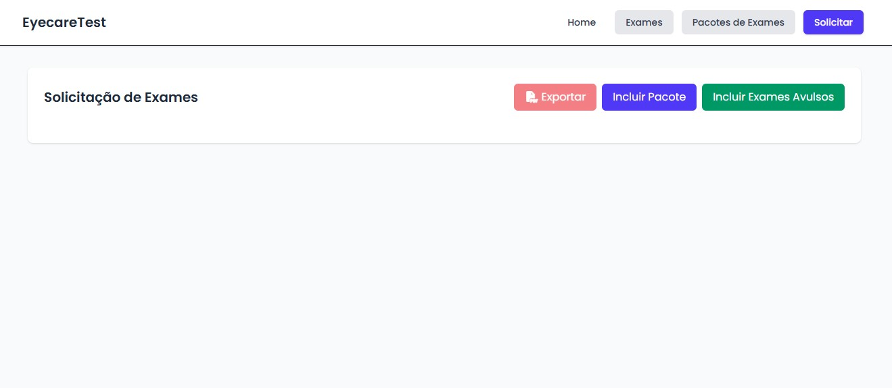
Modal com seleção de pacotes de exames para inserção na seleção
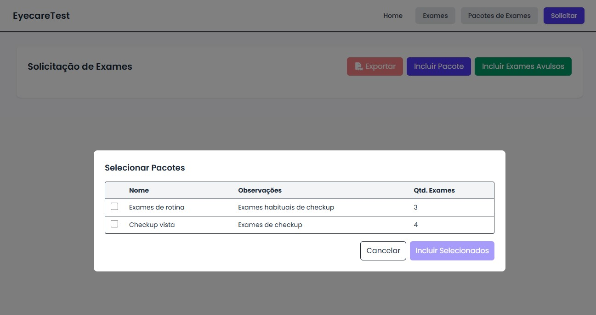
Modal com seleção de exames avulsos para inserção na seleção
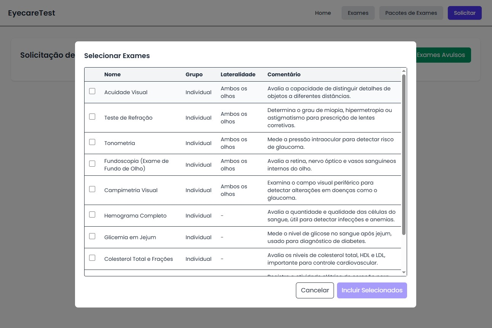
Visão geral da tela de solicitações após seleção de elementos diversos


#### PDF Demo
Na tela de solicitações de exames, ao clicar em exportar, é gerado um PDF com aplicação de regras de negócio diversas e bem distintas que possibilitam inúmeras combinações de visão.
[Visualizar PDF de demonstração](./resources/documents/demo.pdf)
